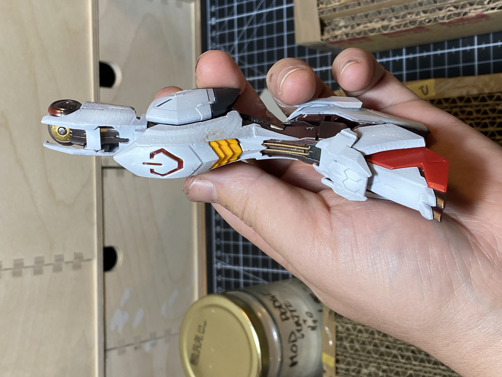
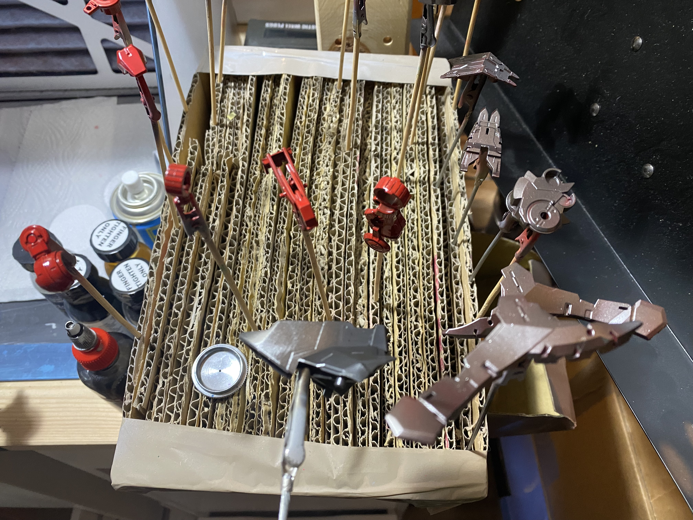
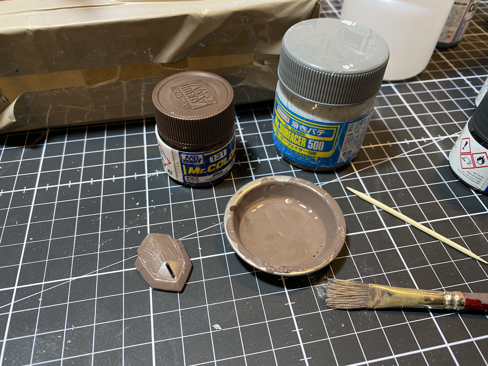

- This was supposed to be a simple and smooth project to get back into the swing of things... but I got excited and started customizing. The build is the [[Bandai/Master Grade]] Barbatos from [[Gundam/Iron Blooded Orphans]], using a couple of the [[Bandai/P-Bandai]] option parts (high heels for the feet, one alternate arm).
- The customizations I've done are pretty limited, mostly around cutting away the outer armor where I thought there was too much white to expose more of the inner frame, and adding tiny bits of extra panelling and guitar string to jazz up the more static bits of frame:
- {:height 1043, :width 776}
- ## Paints
- I really like the contrast between the reddish iron painted with [[Gaia Notes 125 Star Bright Iron]] and [[Mr Color/GX/3 Red]] and the cool white of [[Mr Color/GX/1 White]] and [[Gaia Notes/028 Stone Green]]
- 
- Also pretty happy with the brushed texture under the white, done with [[rapid thinner]] and [[Mr Color/Mr Surfacer/500]] and a coarse stiff brush
- 
-