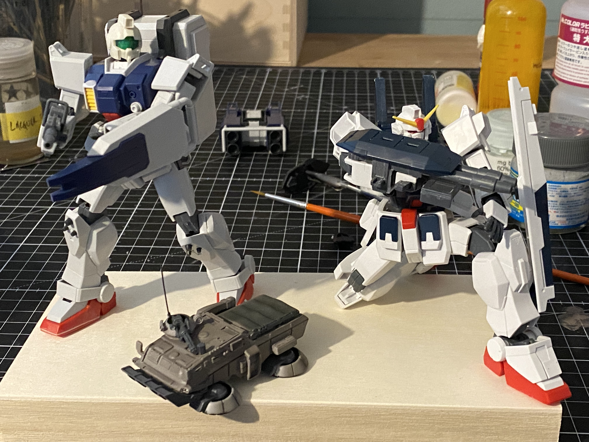
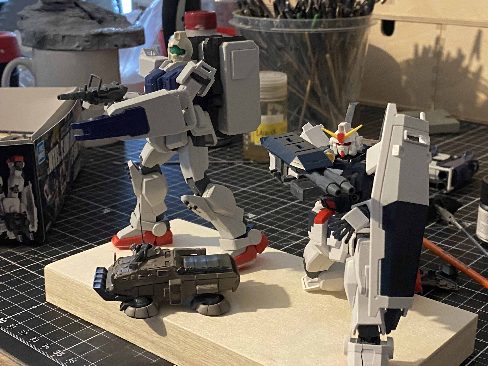

- I finished snapping the [[HGUC Blue Destiny Unit 3 [Exam] ]] the other day, and quickly mocked this up with a [[HGUC RX-79[G] Ground Gundam]] and a [[B-Club 1/144 Hover Truck]]
- Not sure when I'll get around to building it, but I like it. Might add a [[HGUC Gundam EZ-8]] too, but that'll need a bigger base.
- The classic would be to do a jungle dio, but the foliage would be a lot of work. I could also be interested in a desert dio since it would lead to some fun colorways for the MS
-
- 
- 
-