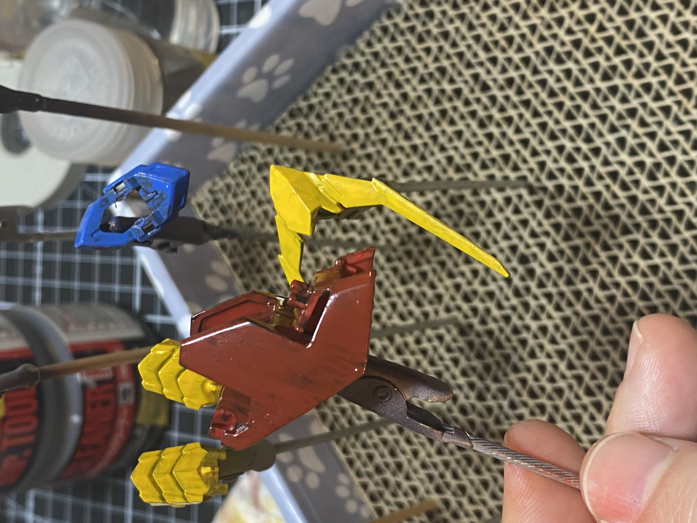

# Progress painting [[MG Barbatos]]
	- This is where I got to last time, visually 
		- I decided the blue was a little too... bright, and also pastel, so today all the work I did was to overbrush it with some super thinned [[Mr Color/125 Cowling Color (almost black blue)]] out of [[lacquer dish/01 black gray]], then go over the top of that with some of the reactivated blue (no new color, just adding thinner) from [[lacquer dish/3 blue]]
		- 