- # Finishing base painting of the [[MG Barbatos]]' legs
	- Today it was just finishing the [[Gaia Notes 125 Star Bright Iron]] painting on the inner frame, and hitting a few details with [[Mr Color/40 German Gray]] and [[Mr Color/Metal Color/219 Brass]]
	- 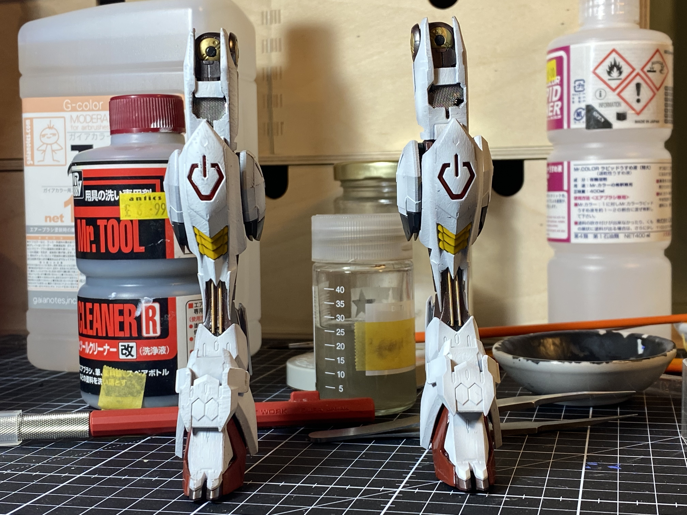
	- 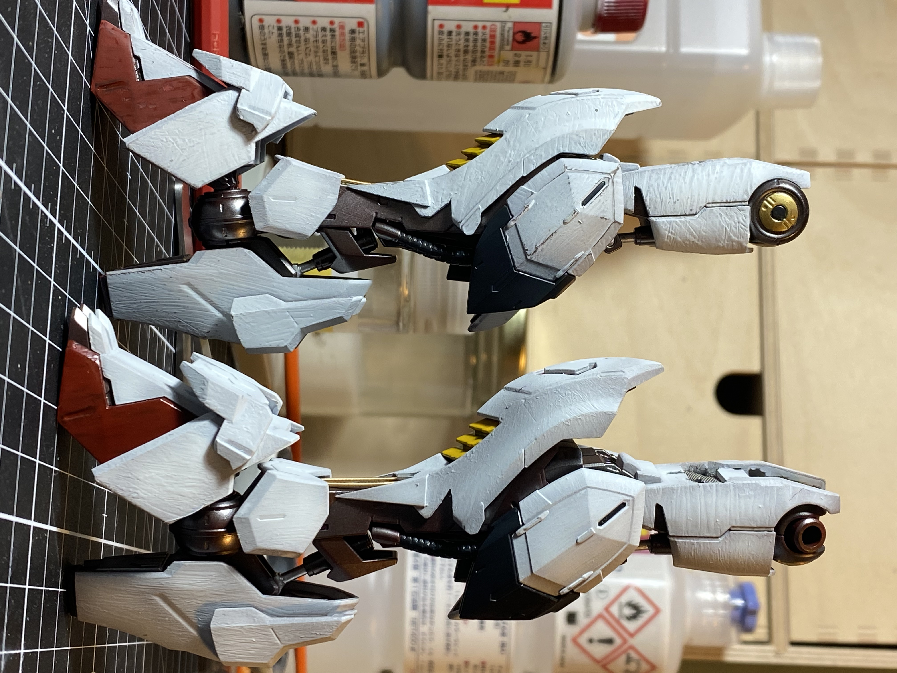
	-
	- 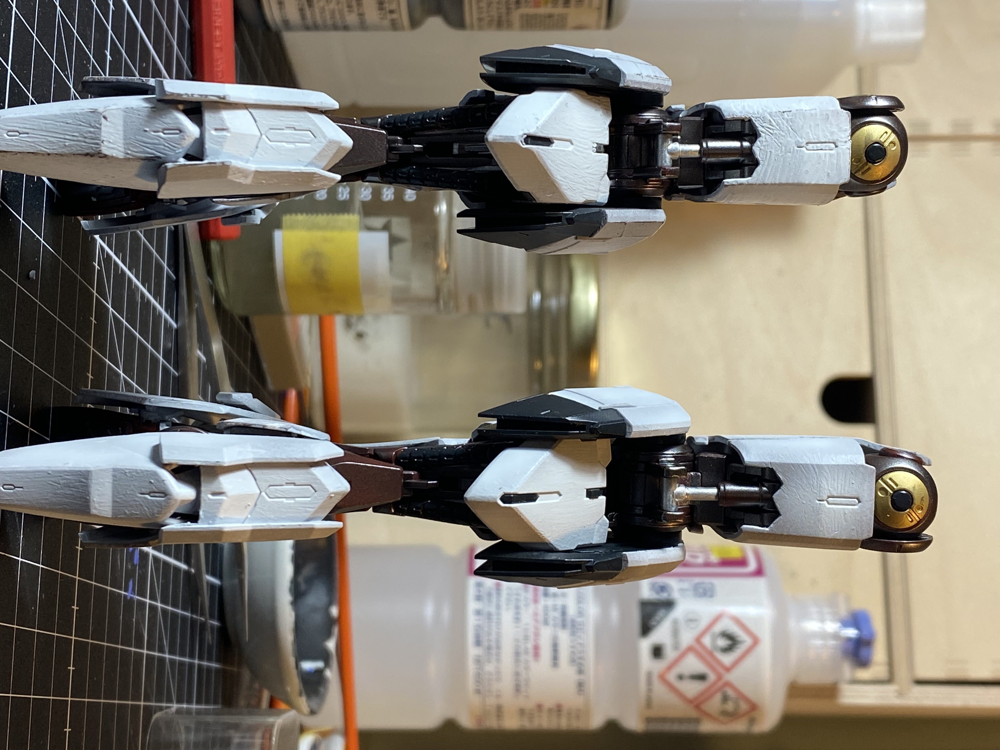
	- 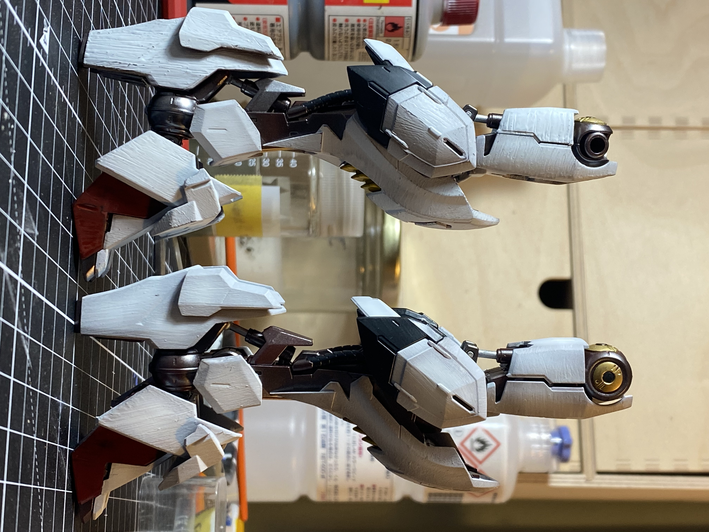
	- And some detail shots
		- 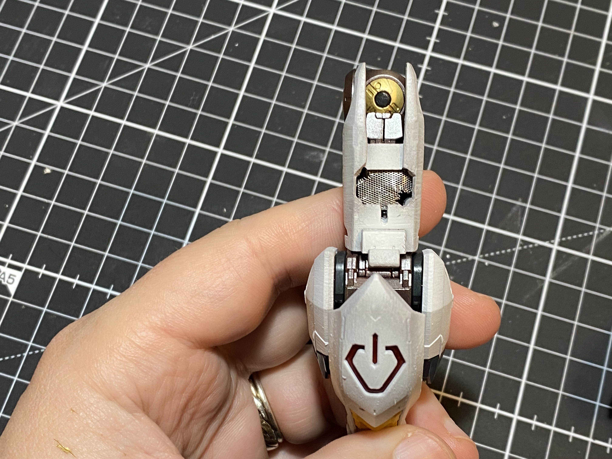
		- 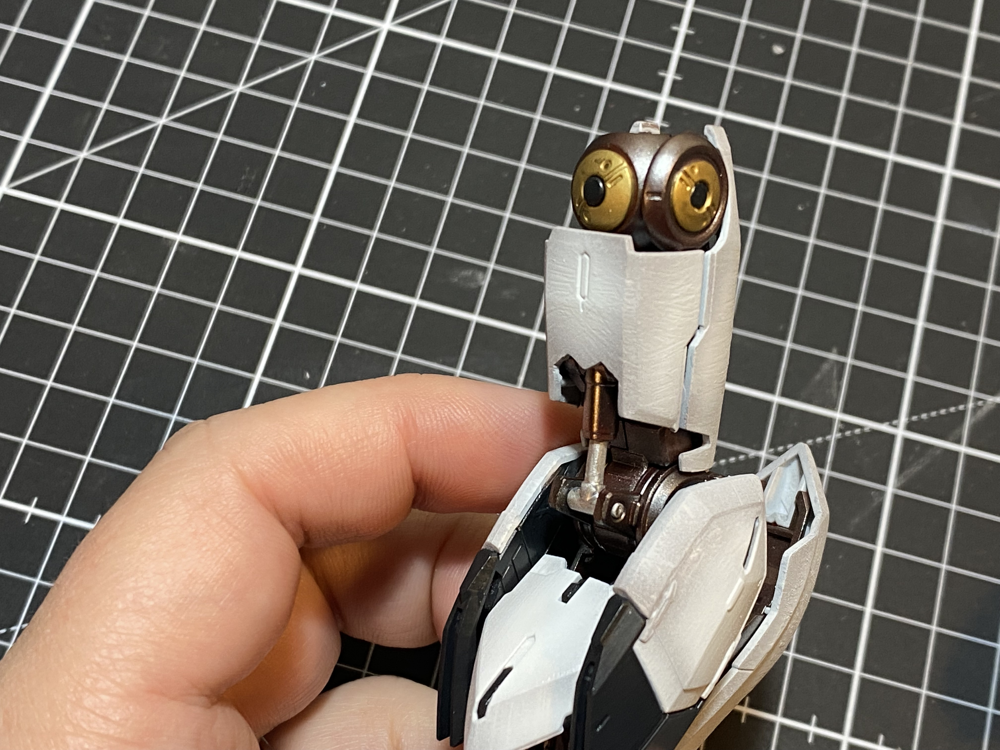
		- 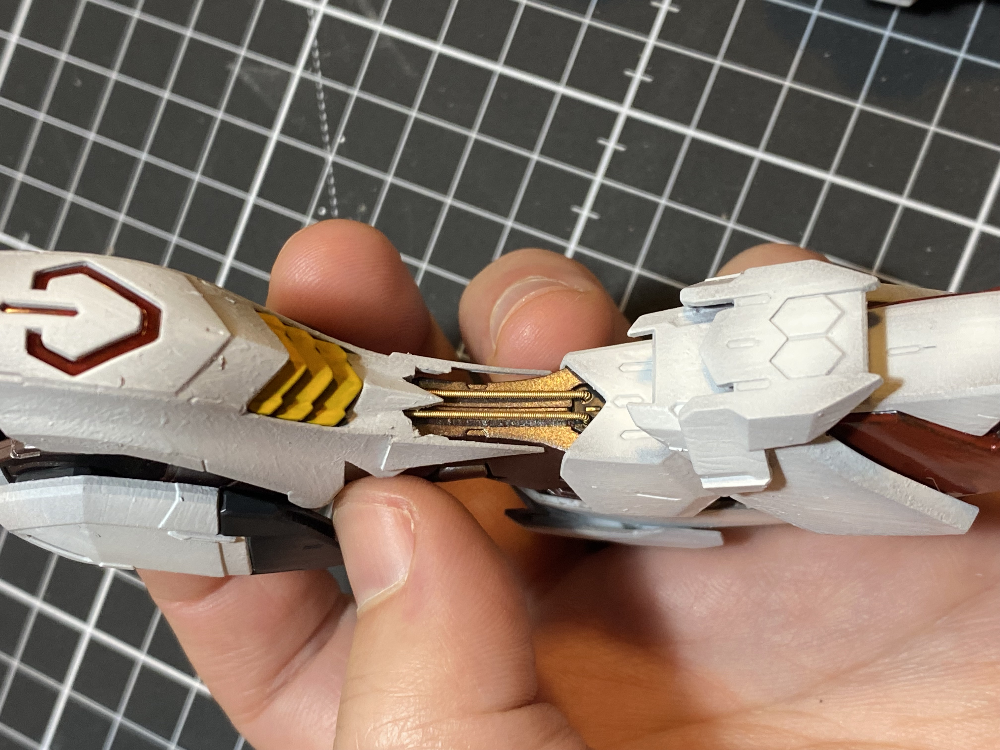
		- 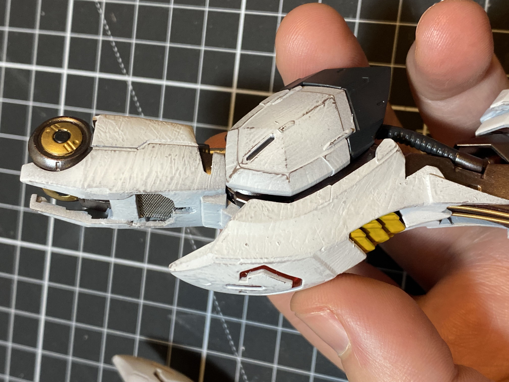
			- This one I started a little sanding and scraping with the flat of a hobby knife
		- 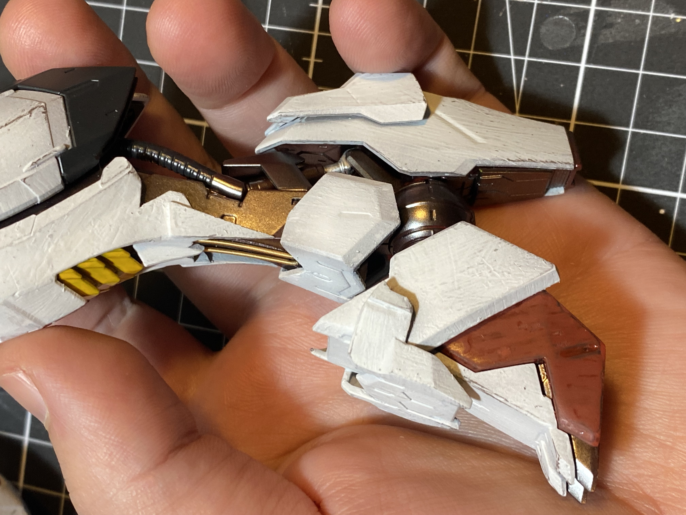
		- 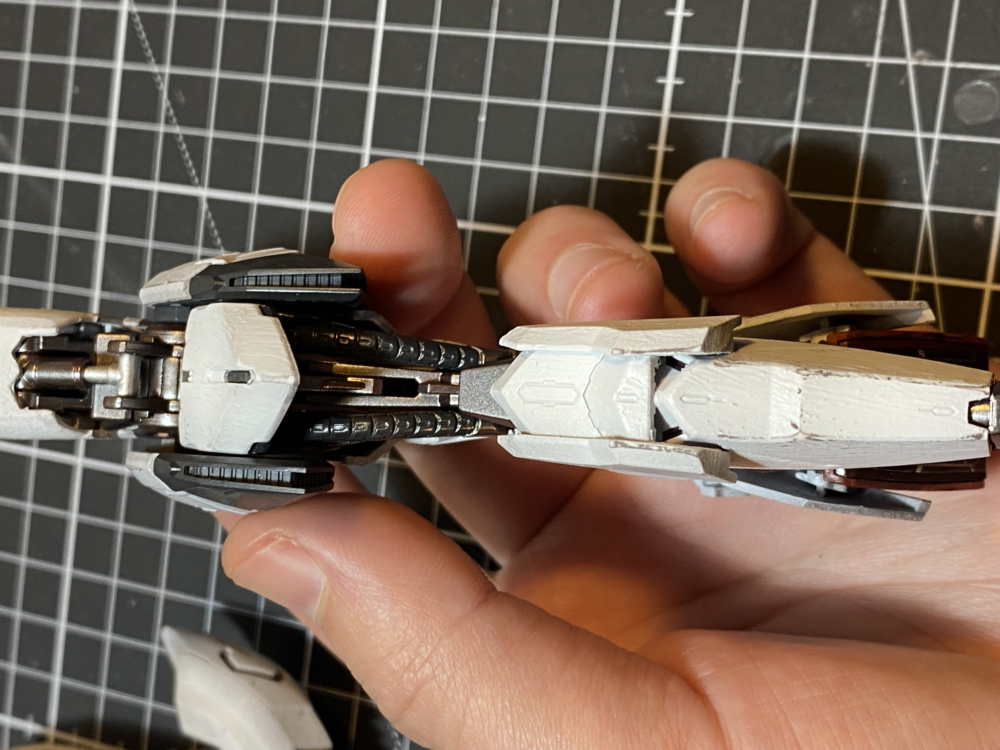
	- 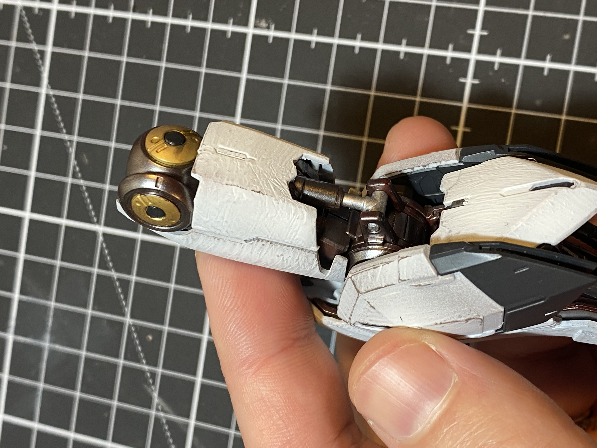