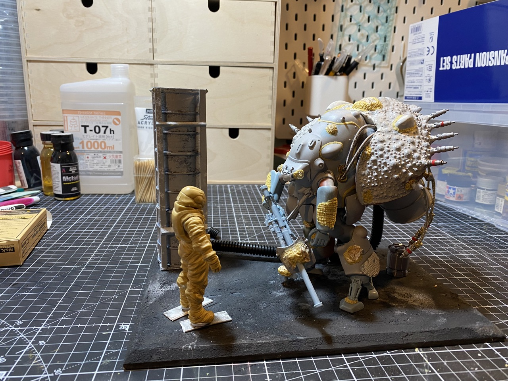
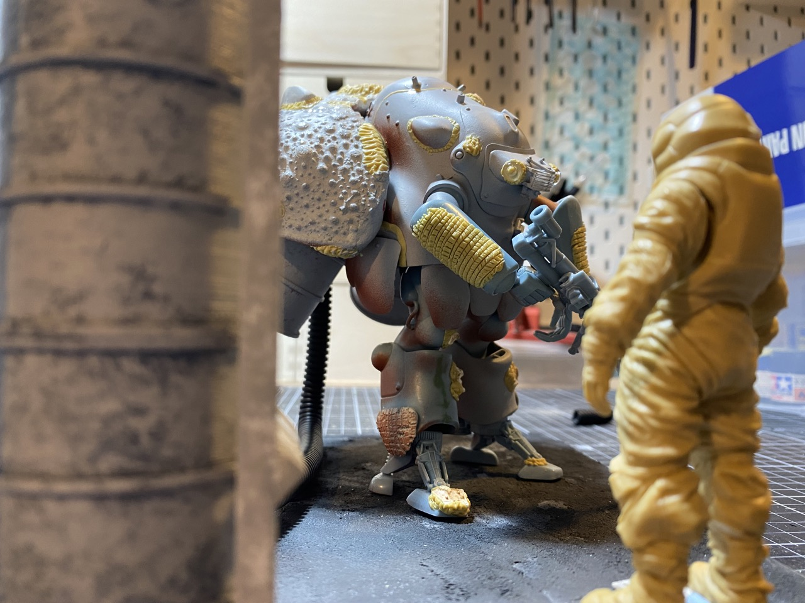
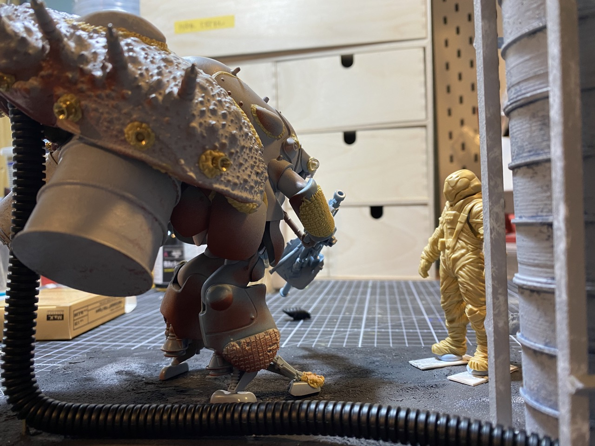
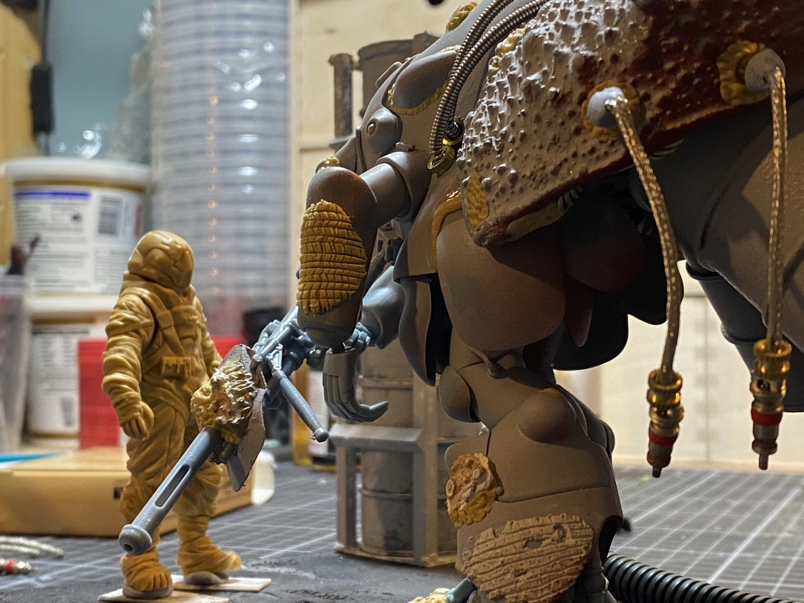
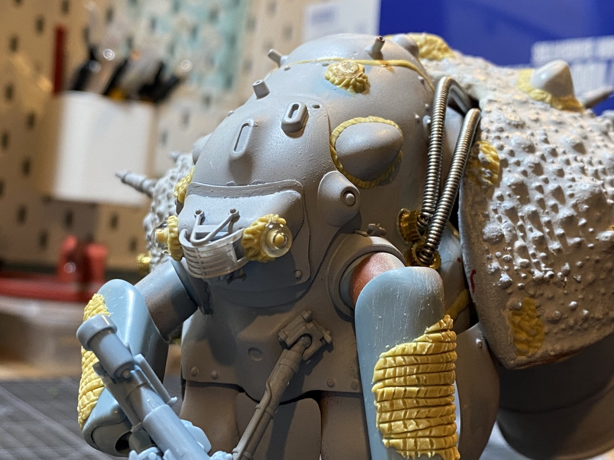
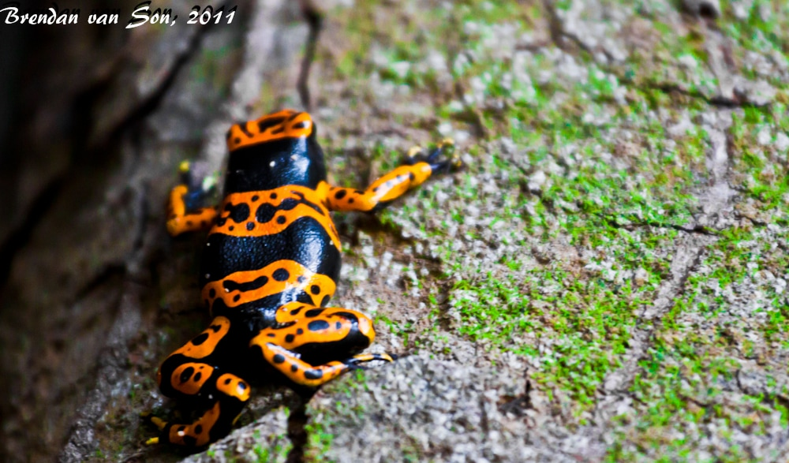
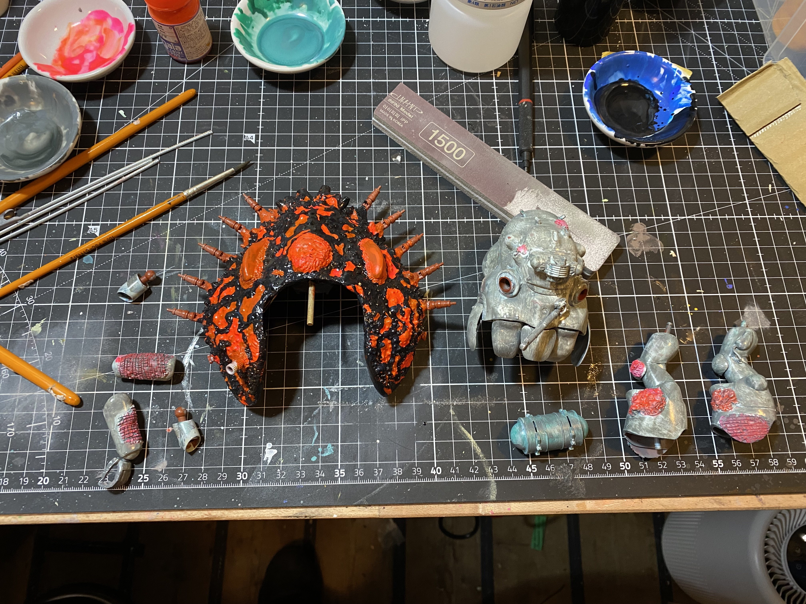

- The [[Mk44癌 CancerKnight]] is slowly coming along. I've finished the build phase, and started painting.
-
- ## Build photos
- Nothing amazingly comprehensive here, but this is the general composition of the CancerKnight
	- 
	- 
	- 
	- 
	- 
- ## Painting Progress
- This has been a lot of fun--every time I handbrush lacquers I love it more.
- Carapace I'm going for a poison-arrow frog warning pattern, using this as a reference:
	- 
- Paint progress so far:
	- Mk44 Body was painted with:
		- [[Mr Color/Mr Surfacer/Oxide Red]] and [[Mr Color/Mr Surfacer/1500 Finishing White]]
		- [[Gaia Notes/028 Stone Green]], out of [[lacquer dish/5 green]], which started out with [[Mr Color/GX/6 Morrie Green]] before the Stone Green
		- [[Gaia Notes/Dougram/CB 22 Blue White]], out of [[lacquer dish/6 cool white]] and [[Mr Color/37 RLM 75 Gray Violet]] out of [[lacquer dish/7 warm medium gray]]
		- Then it was too... gray so I went over it again with the [[Gaia Notes/028 Stone Green]]
		- Then sanded back in bits to reveal some of the under colors
	- Carapace was painted with:
		- [[Mr Color/Mr Surfacer/Oxide Red]]
		- [[Gaia Notes/15 Pure Orange]] out of [[lacquer dish/8 orange]], with some highlights of [[Mr Color/174 Fluorescent Pink]] and [[Gaia Notes/005 Sunshine Yellow]]
		- Then I drew in the dark areas with [[Mr Color/GX/2 Black]] out of [[lacquer dish/3 blue]], which made a really lovely wet looking bluey black
	- 
	- 