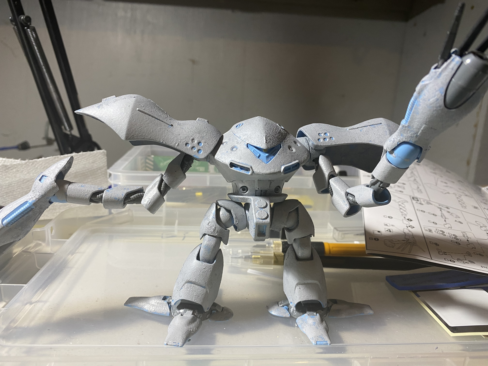

- # HGUC MSM-03 HyGogg in Marine Camo
- 
- This was a lot of fun to work on. The general idea was to do it up in a more [[Kondo Kazuhisa]] style by emphasizing the weight and texture of the machine. The paintwork was a mix of handbrushed and airbrushed lacquers. I started by brushing on a thing webwork of white lines, to try and evoke the effect of light dappling through water:
	- 
	- 
- After that, I traced back over the white lines with an airbrush and bluish/whitish mix to soften them. From there it was a case of mottling on blues, purples, and grays through an airbrush to filter the light lines.
- I kept some constrast with high-shine metallics, though they also got some clear blues and greens as filters.
- I finished with some heavy oil weathering... which unfortunately started attacking the plastic, and I had to do some extensive repairs with superglue.
- 
- 
- 
- 